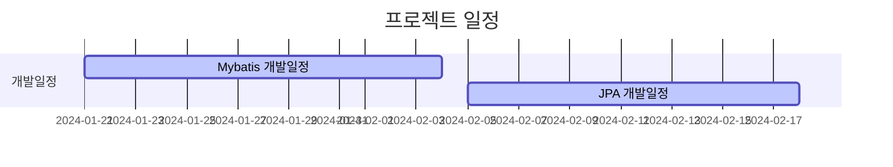

# item-browser

## 프로젝트 개요

`item-browser` 는 다양한 상품을 검색하고, 필터링할 수 있는 온라인 상품 쇼핑몰입니다.
해당 플랫폼은 사용자가 손쉽게 원하는 상품을 찾고, 상세 정보를 확인할 수 있도록 범용적인 설계가 되어 있습니다.
또한, 사용자가 원하는 상품을 장바구니에 담거나, 주문 및 결제할 수 있습니다.

## 개발 환경 및 사용기술

- IDE: IntelliJ IDEA
- Language: Java 11
- Framework: Spring Boot 2.7.1
- Build Tool: Gradle
- DB: MYSQL 5.7
- Test: JUnit5
- API 문서: Swagger3 + Spring RestDocs

---

## API (수정예정)

### 주요 기능

- 상품 검색 및 필터링: 사용자는 다양한 기준으로 상품을 검색하고 필터링할 수 있습니다.
- 상품 상세 정보: 각 상품에 대한 상세 정보를 제공하여 사용자의 구매 결정을 돕습니다.
- 장바구니 및 결제 시스템: 사용자는 선택한 상품을 장바구니에 담고, 결제할 수 있습니다.
- 회원가입 및 로그인: 사용자는 개인 계정을 생성하고 관리할 수 있습니다.
- 주문 상태 확인: 사용자는 주문한 상품의 배송 상태를 실시간으로 확인할 수 있습니다.

---

## GANNT CHART

## 프로젝트 세팅 관련 - (임시)노션 참조